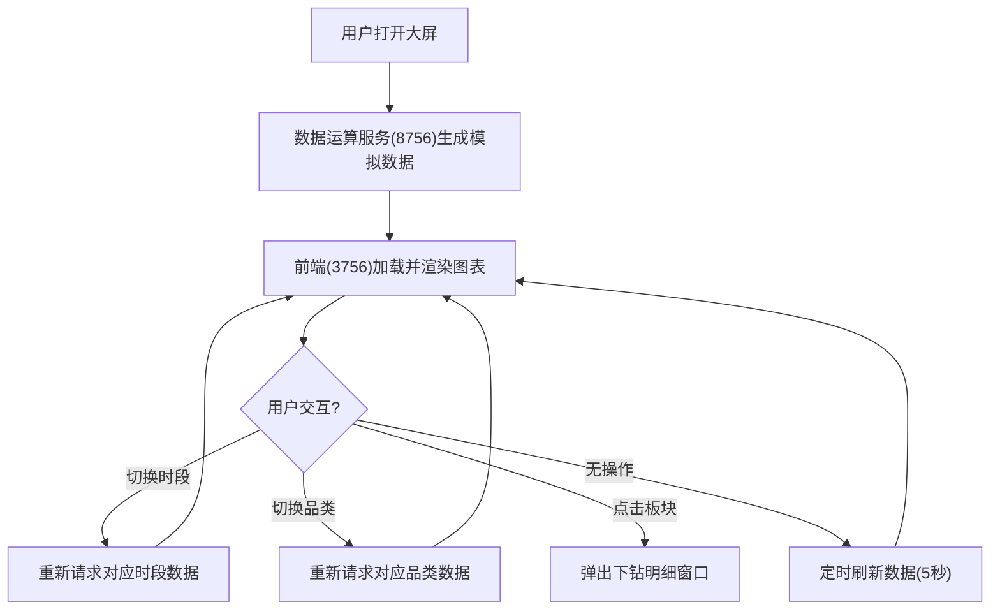

# 电商全链路转化可视化大屏 PRD

## 1. 产品概述
实时监控电商平台商品点击、加购、下单、支付全链路转化数据的可视化大屏系统，帮助运营团队快速洞察流量变化、识别异常转化节点、优化运营策略。
- 面向电商运营团队、数据分析人员、业务决策者
- 核心价值：实时数据驱动决策，提升整体转化率

## 2. 核心功能

### 2.1 用户角色
| 角色 | 注册方式 | 核心权限 |
|------|----------|----------|
| 运营人员 | 系统账号 | 查看大屏、切换维度、下钻明细 |
| 管理员 | 系统账号 | 全部权限 + 数据配置 |

### 2.2 功能模块
1. **大屏主页**：全链路漏斗图、分时流量趋势图、核心KPI指标卡
2. **榜单区域**：热门商品TOP榜单、用户地域分布、支付方式占比
3. **交互控制**：统计时段切换、商品品类筛选、下钻明细弹窗
4. **异常预警**：异常转化节点自动高亮、实时告警提示

### 2.3 页面详情
| 页面名称 | 模块名称 | 功能描述 |
|-----------|-------------|---------------------|
| 大屏主页 | 顶部KPI指标区 | 展示点击量、加购率、下单率、支付率、GMV等核心指标，实时刷新 |
| 大屏主页 | 全链路漏斗图 | 展示点击→加购→下单→支付各环节转化漏斗，异常环节高亮闪烁 |
| 大屏主页 | 分时流量折线图 | 24小时/7天各时段流量变化趋势，多维度对比 |
| 大屏主页 | 热门商品榜单 | TOP10热门商品点击/销量排行，支持下钻查看商品详情 |
| 大屏主页 | 用户地域分布 | 中国地图热力图展示各省份用户分布，支持省份下钻 |
| 大屏主页 | 支付方式占比 | 饼图/环形图展示支付宝/微信/银行卡等支付方式占比 |
| 大屏主页 | 时段切换器 | 支持今日/昨日/近7天/近30天快速切换 |
| 大屏主页 | 品类筛选器 | 全品类/数码/服饰/食品等多品类维度切换 |
| 大屏主页 | 下钻明细弹窗 | 点击各板块弹出对应数据明细表格 |

## 3. 核心流程
用户打开大屏后，系统自动加载实时数据并开始定时刷新。用户可切换时段和品类维度，数据实时联动更新。点击漏斗节点或榜单商品，弹出下钻明细窗口查看详细数据。异常转化节点自动标红并闪烁提醒。

## 4. 用户界面设计

### 4.1 设计风格
- **主色调**：深空蓝(#0a1628)为背景，科技感霓虹蓝(#00d4ff)为主色，活力橙(#ff6b35)为异常警示色
- **辅助色**：转化绿(#00ff88)、警戒黄(#ffd93d)、支付紫(#8b5cf6)
- **按钮样式**：圆角玻璃拟态按钮，带发光边框效果
- **字体**：标题使用 Orbitron 科技感字体，正文使用 Rajdhani 现代无衬线字体
- **布局风格**：网格式仪表盘布局，暗黑科技风，带粒子背景和发光边框效果
- **图标风格**：线性简约图标，带霓虹发光效果

### 4.2 页面设计概述
| 页面名称 | 模块名称 | UI元素 |
|-----------|-------------|-------------|
| 大屏主页 | 顶部KPI指标区 | 5个玻璃拟态卡片，数字滚动动画，图标发光效果 |
| 大屏主页 | 全链路漏斗图 | 渐变色漏斗块，转化率标签，异常节点红色脉冲动画 |
| 大屏主页 | 分时流量折线图 | 平滑曲线，渐变填充，多图例切换，悬浮数据提示 |
| 大屏主页 | 热门商品榜单 | 排名序号色带，进度条对比，hover放大效果 |
| 大屏主页 | 用户地域分布 | 中国地图热力图，省份悬浮高亮，数据标签 |
| 大屏主页 | 支付方式占比 | 环形图，中心显示总额，扇区悬浮展开效果 |
| 大屏主页 | 顶部控制栏 | Logo标题、时段选择器、品类下拉框、实时时间显示 |
| 大屏主页 | 下钻弹窗 | 毛玻璃背景，明细表格，分页控件，关闭动画 |

### 4.3 响应式
- 采用桌面优先设计，针对1920x1080及以上分辨率优化
- 关键图表区域支持最小1366x768分辨率自适应
- 触控设备支持手势缩放地图、滑动切换时段

### 4.4 视觉特效
- 背景：Canvas粒子连线动画，模拟数据流效果
- 数据加载：数字滚动到目标值的缓动动画
- 异常节点：红色脉冲扩散动画 + 黄色边框闪烁
- 板块悬浮：轻微上浮 + 发光边框增强
- 弹窗：缩放出现 + 背景模糊过渡
