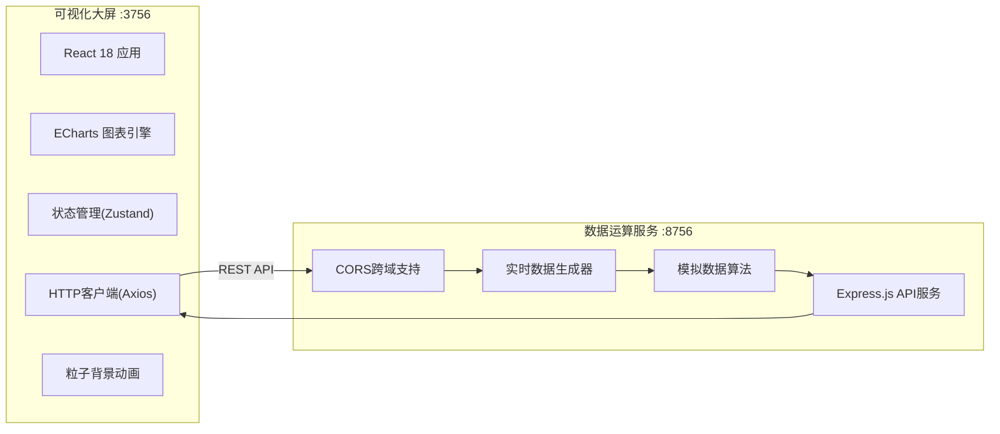
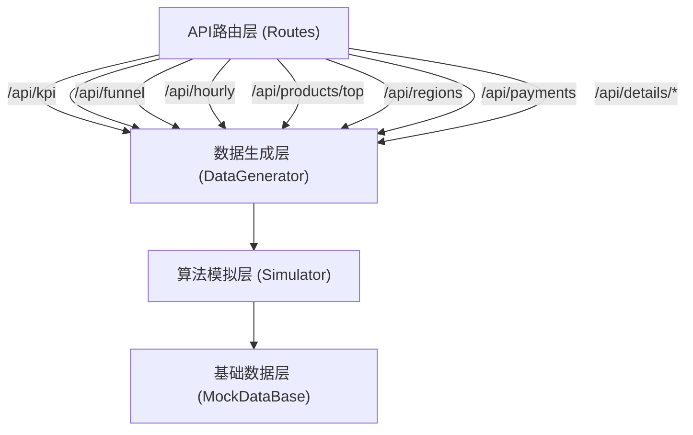
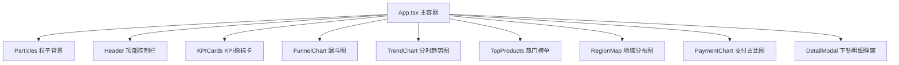

# 电商全链路转化可视化大屏 技术架构文档

## 1. 架构设计



## 2. 技术说明

- **前端技术栈**: React@18 + TypeScript + Vite@5 + TailwindCSS@3 + ECharts@5 + Zustand@4
- **初始化工具**: npm create vite@latest
- **后端技术栈**: Node.js + Express@4 + CORS
- **数据来源**: 数据运算服务实时生成模拟数据，5秒自动刷新
- **端口配置**: 
  - 前端可视化大屏: 3756端口
  - 数据运算API服务: 8756端口

## 3. 路由定义

| 路由 | 用途 |
|-------|---------|
| / | 大屏主页，展示全部可视化模块 |

## 4. API 定义

### 4.1 接口概览

```typescript
// 时段类型
type TimeRange = 'today' | 'yesterday' | '7days' | '30days';

// 品类类型
type Category = 'all' | 'digital' | 'clothing' | 'food' | 'home' | 'beauty';

// 全链路转化数据
interface FunnelData {
  stage: string;
  value: number;
  rate: number;
  isAbnormal: boolean;
}

// KPI指标
interface KPIData {
  clicks: number;
  cartRate: number;
  orderRate: number;
  payRate: number;
  gmv: number;
  clicksChange: number;
  gmvChange: number;
}

// 分时数据
interface HourlyData {
  hour: string;
  clicks: number;
  carts: number;
  orders: number;
  pays: number;
}

// 热门商品
interface TopProduct {
  rank: number;
  name: string;
  image: string;
  clicks: number;
  orders: number;
  gmv: number;
  category: string;
}

// 地域数据
interface RegionData {
  name: string;
  value: number;
  users: number;
  orders: number;
}

// 支付方式
interface PaymentData {
  name: string;
  value: number;
  percentage: number;
}

// 明细数据
interface DetailItem {
  id: string;
  [key: string]: any;
}
```

### 4.2 接口列表

| 方法 | 路径 | 描述 | 请求参数 |
|------|------|------|----------|
| GET | /api/kpi | 获取KPI指标 | timeRange, category |
| GET | /api/funnel | 获取漏斗数据 | timeRange, category |
| GET | /api/hourly | 获取分时趋势 | timeRange, category |
| GET | /api/products/top | 获取热门商品 | timeRange, category, limit |
| GET | /api/regions | 获取地域分布 | timeRange, category |
| GET | /api/payments | 获取支付方式 | timeRange, category |
| GET | /api/details/funnel | 漏斗下钻明细 | stage, timeRange, category, page, pageSize |
| GET | /api/details/product | 商品下钻明细 | productId, timeRange, page, pageSize |
| GET | /api/details/region | 地域下钻明细 | region, timeRange, page, pageSize |

## 5. 服务端架构



- **API路由层**: Express路由定义，处理请求参数校验和CORS
- **数据生成层**: 根据时段和品类参数调用算法生成对应数据
- **算法模拟层**: 基于随机波动+真实电商规律生成逼真数据，内置异常注入逻辑
- **基础数据层**: 商品名称库、省份列表、支付方式等静态模拟数据

## 6. 前端组件架构



## 7. 状态管理

使用 Zustand 管理全局状态：

```typescript
interface DashboardStore {
  timeRange: TimeRange;
  category: Category;
  kpiData: KPIData | null;
  funnelData: FunnelData[];
  hourlyData: HourlyData[];
  topProducts: TopProduct[];
  regionData: RegionData[];
  paymentData: PaymentData[];
  refreshInterval: number;
  setTimeRange: (t: TimeRange) => void;
  setCategory: (c: Category) => void;
  fetchAllData: () => Promise<void>;
  openDetail: (type: string, params: any) => void;
}
```

## 8. 项目目录结构

```
lp0066/
├── .trae/documents/          # 文档目录
├── dashboard/                # 前端可视化大屏 (3756)
│   ├── src/
│   │   ├── components/       # 组件目录
│   │   │   ├── Header.tsx
│   │   │   ├── KPICards.tsx
│   │   │   ├── FunnelChart.tsx
│   │   │   ├── TrendChart.tsx
│   │   │   ├── TopProducts.tsx
│   │   │   ├── RegionMap.tsx
│   │   │   ├── PaymentChart.tsx
│   │   │   ├── DetailModal.tsx
│   │   │   └── Particles.tsx
│   │   ├── store/            # 状态管理
│   │   │   └── useDashboardStore.ts
│   │   ├── services/         # API服务
│   │   │   └── api.ts
│   │   ├── types/            # 类型定义
│   │   │   └── index.ts
│   │   ├── App.tsx
│   │   ├── main.tsx
│   │   └── index.css
│   ├── package.json
│   ├── vite.config.ts
│   ├── tailwind.config.js
│   └── tsconfig.json
└── data-server/              # 数据运算服务 (8756)
    ├── src/
    │   ├── index.js          # Express入口
    │   ├── routes/           # 路由定义
    │   │   └── index.js
    │   └── generators/       # 数据生成器
    │       └── index.js
    └── package.json
```
